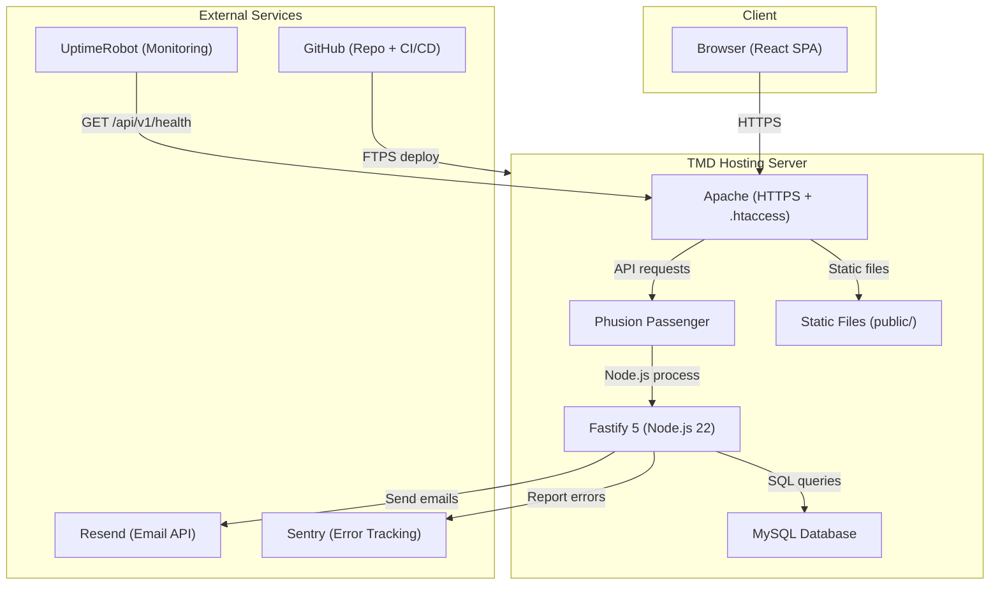
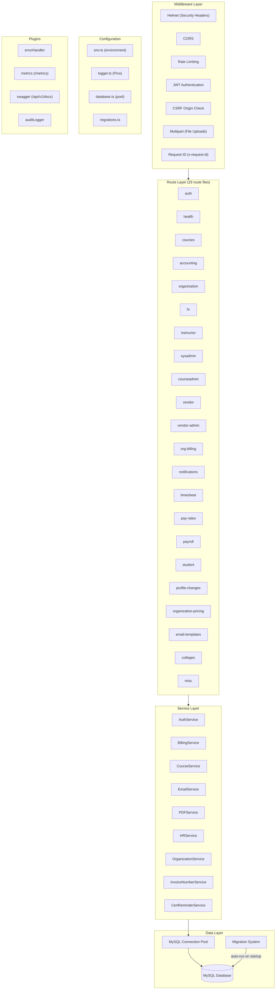
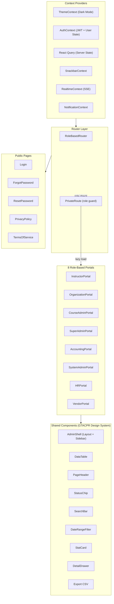
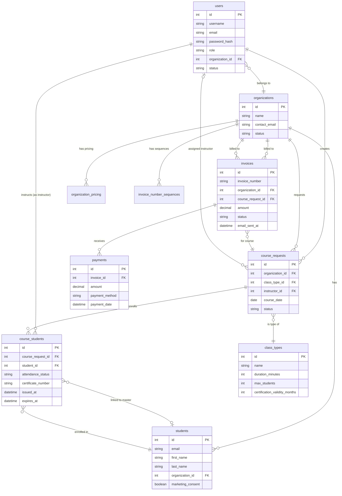
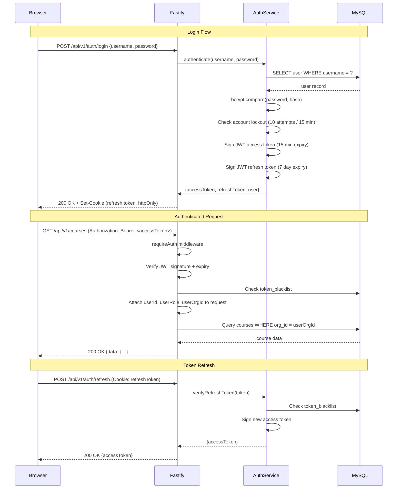
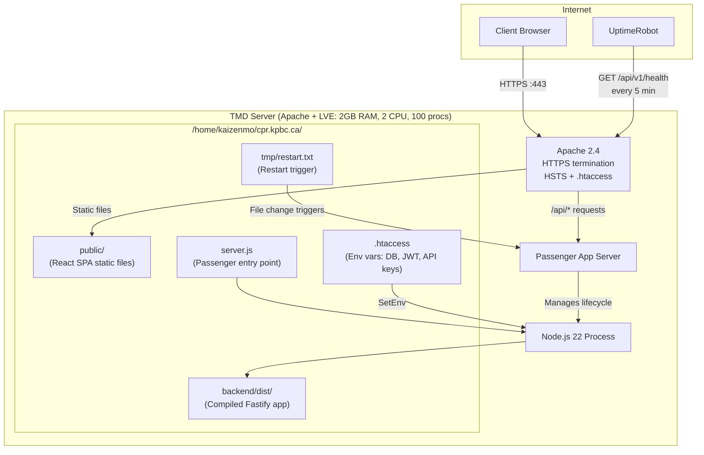

# CPR Training Management System - Architecture Diagrams

**Last Updated**: 2026-06-28
**Stack**: Fastify 5 (Node.js 22) + React 18 + MySQL on TMD Hosting (Apache + Passenger)

This document provides text-based architecture diagrams using Mermaid syntax. Render these in any Mermaid-compatible viewer (GitHub, VS Code with Mermaid extension, mermaid.live, etc.).

---

## 1. System Architecture

High-level overview of all components and external services.

Apache terminates TLS and serves the frontend static files directly. API requests (`/api/v1/*`) are proxied through Passenger to the Fastify backend. The SPA fallback (`.htaccess` rewrite rules + Fastify `setNotFoundHandler`) ensures client-side routing works for deep links.

---

## 2. Backend Architecture

The backend follows a layered architecture: Routes handle HTTP concerns, Services contain business logic, and Repositories/direct queries handle data access.

### Route Registration

All routes are registered under the `/api/v1` prefix via `routes/index.ts`. The route file also registers:
- `POST /client-errors` -- client-side error collector (rate-limited, unauthenticated)
- `GET /events` -- SSE endpoint for real-time updates (authenticated)
- OpenAPI docs at `/api/v1/docs` via `@fastify/swagger`

### Middleware Chain

Every request passes through the following middleware (in order):
1. **Helmet** -- security headers (CSP, HSTS, X-Frame-Options)
2. **CORS** -- restricts to `FRONTEND_URL` origin, credentials allowed
3. **Rate Limiting** -- 100 req/min global; tighter limits on auth routes (20 req/15min)
4. **CSRF** -- verifies `Origin` header on POST/PUT/PATCH/DELETE
5. **Request ID** -- assigns `x-request-id` (from header or generated UUID)
6. **Cookie** -- parses cookies for refresh token handling
7. **JWT Auth** -- `requireAuth` middleware on protected routes; extracts `userId`, `userRole`, `userOrgId`

---

## 3. Frontend Architecture

React SPA with role-based portal routing, context providers, and lazy-loaded portal chunks.

### Portal Roles

| Portal | Role Key | URL Prefix | Description |
|--------|----------|------------|-------------|
| Instructor | `instructor` | `/instructor/*` | Class management, attendance, timesheets |
| Organization | `organization` | `/organization/*` | Course requests, roster, billing |
| Course Admin | `admin` | `/admin/*` | Course scheduling, instructor assignment |
| Super Admin | `superadmin` | `/superadmin/*` | System-wide admin controls |
| Accounting | `accountant` | `/accounting/*` | Invoicing, payments, revenue reports |
| System Admin | `sysadmin` | `/sysadmin/*` | Users, orgs, courses, students, certs, audit logs, WSIB |
| HR | `hr` | `/hr` | Employee management, pay rates |
| Vendor | `vendor` | `/vendor/*` | Vendor invoices, profile |

All portals are **lazy-loaded** via `React.lazy()` and wrapped in `Suspense` with a loading spinner. Each portal is protected by `PrivateRoute` which checks the user's JWT role claim.

---

## 4. Database Architecture

Simplified ERD showing the main entities and their relationships.

### Additional Tables (Not Shown)

- `schema_migrations` -- tracks applied database migrations
- `token_blacklist` -- invalidated JWT tokens (on password change/logout)
- `audit_logs` -- audit trail for sensitive actions
- `notification_preferences` / `notifications` -- user notification settings
- `vendor_invoices` -- vendor billing
- `instructor_pay_rates` / `pay_rate_history` -- instructor compensation
- `organization_pricing` -- per-org pricing overrides
- `invoice_number_sequences` -- configurable invoice number formats per org
- `email_reminders` / `certification_reminders` -- dedup tables for reminder emails
- `profile_changes` -- instructor profile change requests

---

## 5. Authentication Flow

JWT-based authentication with access and refresh tokens.

### Key Security Features

- **Access tokens**: 15-minute expiry, sent as `Authorization: Bearer` header
- **Refresh tokens**: 7-day expiry, stored in httpOnly cookie
- **Account lockout**: 10 failed attempts triggers 15-minute lockout
- **Token blacklist**: Tokens are blacklisted on password change and logout
- **Bcrypt**: Password hashing with 12 salt rounds
- **Org scoping**: `userOrgId` from JWT is used in WHERE clauses to enforce multi-tenant isolation
- **Role middleware**: `requireRole('admin', 'sysadmin')` guards protect role-specific endpoints

---

## 6. Deployment Architecture

End-to-end flow from code commit to running application.

```mermaid
graph LR
    subgraph Dev["Developer"]
        Code["Code Changes"]
        LocalBuild["Local Frontend Build<br/>(vite build -- server OOM)"]
    end

    subgraph GitHub["GitHub"]
        Repo["cpr-fastify repo"]
        Actions["GitHub Actions CI/CD"]
    end

    subgraph CI["CI Pipeline"]
        TSC["TypeScript Check"]
        Vitest["Vitest Tests"]
        ViteBuild["Vite Build"]
        FTPSDeploy["FTPS Upload"]
    end

    subgraph TMD["TMD Hosting Server"]
        Cron["Hourly Cron (:48)"]
        DeployScript["deploy-production.sh"]
        Apache2["Apache + SSL"]
        Passenger2["Passenger"]
        Fastify2["Fastify 5"]
        MySQL2[("MySQL")]
        Restart["touch tmp/restart.txt"]
    end

    Code -->|"git push"| Repo
    Repo -->|"on push to master"| Actions
    Actions --> TSC
    TSC --> Vitest
    Vitest --> ViteBuild
    ViteBuild --> FTPSDeploy
    FTPSDeploy -->|"backend/dist/ + public/"| TMD

    Cron -->|"hourly pull + build"| DeployScript
    DeployScript --> Restart

    FTPSDeploy --> Restart
    Restart --> Passenger2
    Passenger2 --> Fastify2
    Fastify2 -->|"runMigrations()"| MySQL2
    Apache2 --> Passenger2
```

### Deployment Paths

There are two deployment paths that can both be active:

1. **CI/CD (primary)**: Push to `master` -> GitHub Actions builds and tests -> FTPS upload to server -> restart Passenger -> health check
2. **Server cron (backup)**: Hourly at `:48`, the server pulls from `master`, builds via `tsc`, and restarts Passenger

### Server Architecture Detail

### Environment Variables

All secrets are configured via `SetEnv` directives in `/home/kaizenmo/cpr.kpbc.ca/.htaccess`:

- `NODE_ENV`, `PORT`
- `DB_HOST`, `DB_PORT`, `DB_USER`, `DB_PASSWORD`, `DB_NAME`
- `JWT_SECRET`, `JWT_ACCESS_SECRET`, `JWT_REFRESH_SECRET`, `JWT_RESET_SECRET`
- `FRONTEND_URL`
- `RESEND_API_KEY`, `EMAIL_FROM`
- `SENTRY_DSN`
- `REDIS_ENABLED`, `BCRYPT_SALT_ROUNDS`
- `ACCESS_TOKEN_EXPIRY`, `REFRESH_TOKEN_EXPIRY`

These are never committed to the repository.
